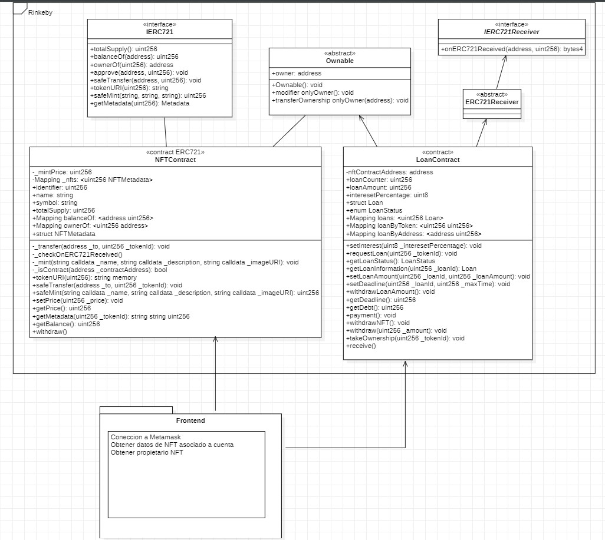
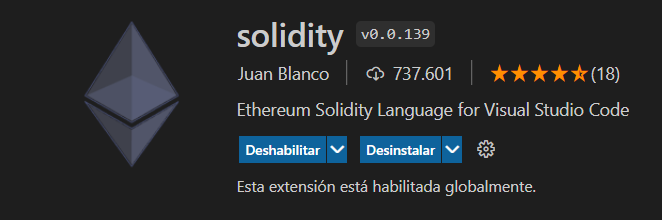
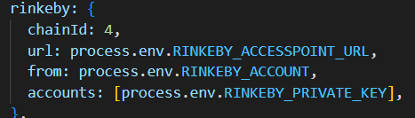
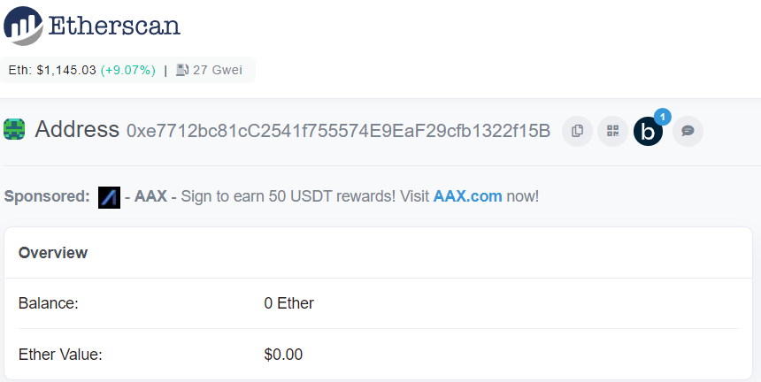
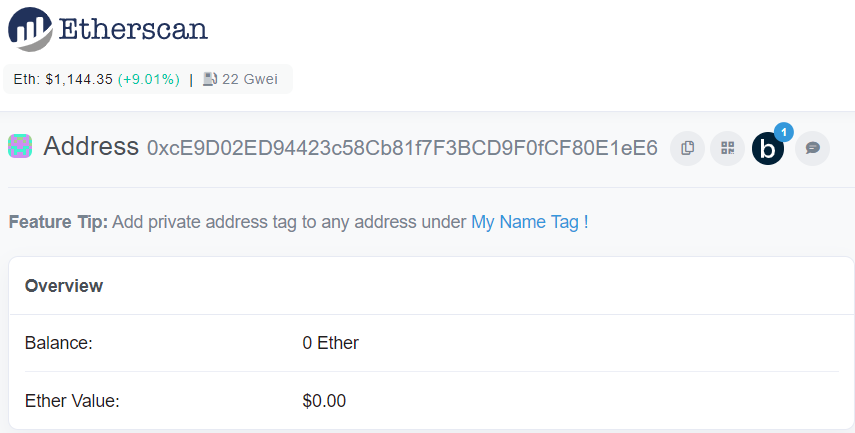
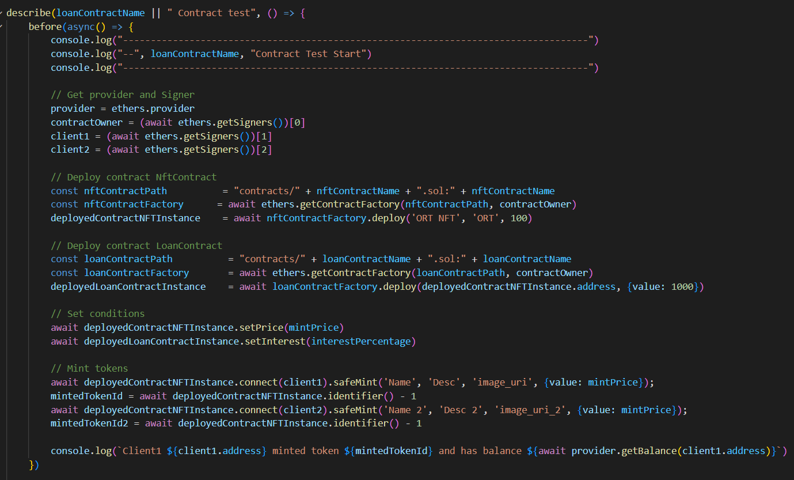

# Programación de Contratos Inteligentes en Blockchain.

## Descripción del proyecto

El proyecto se enmarca en la creación de un contrato inteligente que permita a los usuarios mintear sus propios NFT o tokens no fungibles. De la misma manera, el protocólo debe poder permitir utilizar el NFT minteado como garantía para obtener un préstamos en ethers.

## Componentes del proyecto

El repositorio se encuentra dividido entre dos grandes carpetas, una es el Frontend donde podemos encontrar toda la lógica referida al diseño de la interfaz gráfica que se comunica con nuestra otra gran división llamada Backend, donde encontramos nuestra lógica de negocio, más precisamente, los contratos inteligentes "NFTContract" y "LoanContract", conjuntamente con sus tests unitarios.

En el Contrato NFTContract implementamos el standard ERC-721 y en el LoanContract podremos encontrar la lógica para dar prestamos a las addresses usando como garantía los NFTs.

## Pasos para hacer el setup del repositorio

Para hacer el setup del repositorio es necesario **clonar** el mismo desde la página de GitHub que es la herramienta utilizada para versionar nuestro desarrollo, o de lo contrario se podría **descargar** un ZIP sin necesidad de tener Git instalado. 

Luego, es necesario contar con un IDE o un editor de código fuente como el Visual Studio Code e **instalarle la extensión** para que reconozca nuestro código en Solidity

También, es necesario **definir** nuestras variables de entorno declaradas en el archivo **.env** para poder interactuar con nuestros contratos, definiendo nuestra instancia de Ganache que nos permite definir nuestra blockchain privada para correr nuestros tests de prueba.

## Pasos para hacer el deploy

Para realizar el deploy añadimos dentro de el archivo **hardhat.config.js** la red rinkeby para poder deployar nuestros contratos digitales. Añadimos la url de nuestro proveedor de Infura para poder deployar a la red rinkeby. También incluimos la clave privada de nuestro account de metamask y su respectiva address. Dichas variables de entorno fueron guardadas en un archivo .env.

En el archivo **deploy.js** se asigna los contratos a deployar y se crea el objeto signer donde se almacenarán las address y el provider por el cual se instancie.

Mediante el comando **npx hardhat run scripts/deploy.js --network rinkeby**, comenzamos con el deploy utilizando la network de rinkeby con la configuración previamente establecida.

**Contrato "NFTContract"**

**Contrato "LoanContract"**

## Pasos para la ejecución de tests

Las pruebas unitarias a diferencia de las pruebas de integración son pruebas individuales de componentes y métodos, sin contar las pruebas en sus dependencias como estas últimas si tienen en cuenta.

El sentido de las pruebas unitarias, es poder probar nuestro código evitando probar también sus dependencias, asegurándonos que los errores se restringen únicamente al código que efectivamente queremos probar.

**Para realizar estas pruebas se utilizó una librería de testing llamada Chai y se deployó  sobre la red de HardHat Network.** Con ellas probamos la mayoría de las funcionalidades, prestando especial atención en el pedido de préstamos y el retiro del dinero en caso de ser aprobado el mismo.

Para Probar el contrato inteligente LoanContract definimos un archivo llamado **LoanContract.test.js** donde se encuentran los test realizados a dicho contrato. Antes de ejecutar los test se corre por única vez el before que es el encargado de obtener las instancias de los contratos y de inicializar los distintos signers como el owner, client1 y client2 requeridos para probar nuestros distintos modifiers y lógica.

Como se puede observar en la imagen, luego se setea el precio del minteo de los NFTs con el método setPrice(), los intereses para los préstamos con el método setIntereset()  y se mintea algún token para seguir con el flujo.

Para probar el contrato inteligente NFTContract definimos un archivo llamado **NFTContract.test.js** y en su before al igual que en el before del LoanContract.test.js obtenemos la instancia del contrato.

Por último, para correr los tests es necesario estar en la ruta de la carpeta que contiene los archivos **.test.js** llamada tests y correr el comando por consola **npx hardhat test**

## Address de contratos deployados en testnet

| Contract Name | Contract Address| Contract Balance | Signer Address
|--|--|--|--|
| NFTContract | 0xe7712bc81cC2541f755574E9EaF29cfb1322f15B| 0 |0x6b950Bc42743ee97734d1feda101a2FC41542B37
| LoanContract | 0xcE9D02ED94423c58Cb81f7F3BCD9F0fCF80E1eE6| 0 |0x6b950Bc42743ee97734d1feda101a2FC41542B37

## Integrantes del equipo

| Nombre | Nro. de estudiante | Address 
|--|--|--|
| Germán Castro | 187553 | 0x61214c38530E969a39F3d44e3c36878Af74F8321
| Juan Andrés Nervi | 223393 | 0x272C2DF626197E61C35Db9c78346ddb082e209CE
| Santiago Topolansky | 228360 | 0x6b950Bc42743ee97734d1feda101a2FC41542B37
| Valentín Sanchez| 203458 | 0x1A4Fa105d6a434E67749CFDEd0c86F9d971e37C7
