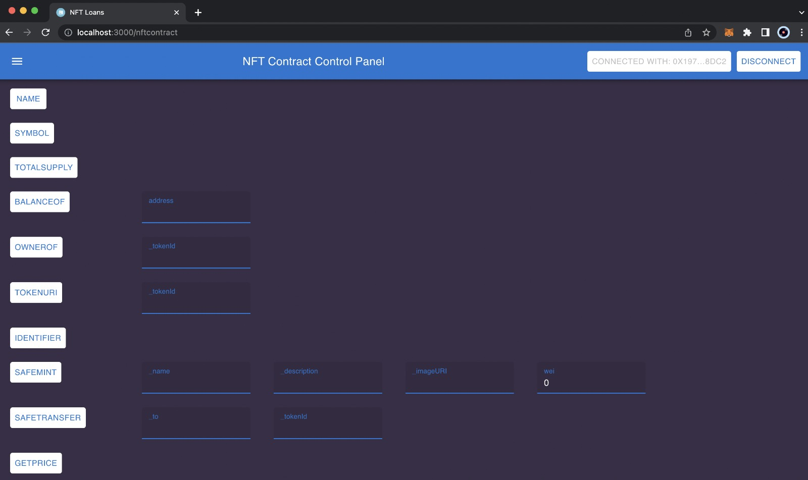

# Smart Contract Programming on Blockchain.

## Project Description

The project aims to create a smart contract that allows users to mint their own NFTs (Non-Fungible Tokens). Additionally, the protocol should enable the use of the minted NFTs as collateral to obtain loans in ethers.

## Project Components

The repository is divided into two main folders. The first one is the Frontend, containing all the logic related to the graphical user interface that communicates with the other major division called Backend. In the Backend, we find our business logic, specifically the smart contracts "NFTContract" and "LoanContract," along with their unit tests.

In the NFTContract, we implement the ERC-721 standard for NFTs, and in the LoanContract, we have the logic for providing loans to addresses using NFTs as collateral.

## Steps to Set Up the Repository

To set up the repository, you need to clone it from GitHub, the version control tool used for our development. Alternatively, you can download a ZIP file without having Git installed.

Next, you need an IDE or a source code editor like Visual Studio Code and install the Solidity extension so that it can recognize our Solidity code.

You also need to define environment variables declared in a `.env` file (see the example file `.env.local`) to interact with our contracts. This includes defining a Ganache instance, which allows us to set up a private blockchain for running the test suite.

## Steps to Deploy

To deploy, we add the rinkeby network within the `hardhat.config.js` file to deploy our digital contracts. We include the Infura provider URL to deploy to the rinkeby network. Also, we include the private key of our Rinkeby account (linked to our Metamask) and its corresponding address. These environment variables are stored in the `.env` file.

In the deploy.js file, we assign the contracts to be deployed and create the signer object to store the addresses and the provider to be used for instantiation.

By running the command `npx hardhat run scripts/deploy.js --network rinkeby`, we start the deployment process using the rinkeby network with the previously established configuration.

After deploying, we can view our contracts on Etherscan:

"NFTContract" Contract

"LoanContract" Contract

## Steps to Execute Tests

The unit tests, unlike integration tests, are individual tests for components and methods without considering their dependencies.

The purpose of unit tests is to test our code in isolation, avoiding testing its dependencies, ensuring that errors are restricted only to the code we want to test.

To perform these tests, we used the testing library called Chai and deployed it on the HardHat Network. With these tests, we verify most of the functionalities, paying special attention to the loan request and withdrawal process when approved.

To test the LoanContract smart contract, we created a file called `LoanContract.test.js`, where we have the tests for that contract. Before running the tests, we run the before function, which is responsible for obtaining the contract instances and initializing different signers like the owner, client1, and client2 required for testing various modifiers and logic.

As shown in the image, we then set the price for minting NFTs using the setPrice() method, set the interest for loans using the setInterest() method, and mint some tokens to proceed with the flow.

To test the NFTContract smart contract, we defined a file called `NFTContract.test.js`. In its _before_ function, similar to the before in LoanContract.test.js, we obtain the contract instance.

Finally, to run the tests, navigate to the tests folder containing the `.test.js` files and run the command `npx hardhat test` in the console.

## Steps to Execute the Frontend

To run the Frontend, navigate to its directory and execute the command `npm install` to install the dependencies. Once completed, run the command `npm start` to start the application.

The Frontend was developed with React. Similar to the Remix page (an IDE for developing, deploying, and managing smart contracts on Ethereum), the idea was to allow interaction with all the functionalities through our Frontend, displaying response messages and enabling the complete flow. Furthermore, we fulfilled the requirements of connecting with the MetaMask wallet to sign transactions, retrieve all data from a minted NFT, and get the owner of the NFT.

Connecting with MetaMask

NFTContract Interface

LoanContract Interface

## Loan Approval Flow

To illustrate the flow of requesting a loan, getting it approved, and allowing the contract owner to receive it, we created a sequence diagram that highlights the main methods to be invoked along with their respective attributes.

The diagram shows how the NFT is transferred so that the new owner becomes the "LoanContract" and, once done, how the "WithdrawLoanAmount" method is called to withdraw the money.

## Deployed Contract Addresses on Testnet

| Contract Name | Contract Address | Contract Balance | Signer Address

|--|--|--|--|

| NFTContract | 0xe7712bc81cC2541f755574E9EaF29cfb1322f15B | 0 | 0x6b950Bc42743ee97734d1feda101a2FC41542B37

| LoanContract | 0xcE9D02ED94423c58Cb81f7F3BCD9F0fCF80E1eE6 | 0 | 0x6b950Bc42743ee97734d1feda101a2FC41542B37

## Team Members

| Nombre | Address |

| ------------------- | ------- |

| Germán | 0x61214c38530E969a39F3d44e3c36878Af74F8321 |

| Juan Andrés | 0x272C2DF626197E61C35Db9c78346ddb082e209CE |

| Santiago | 0x6b950Bc42743ee97734d1feda101a2FC41542B37 |

| Valentín | 0x1A4Fa105d6a434E67749CFDEd0c86F9d971e37C7 |
